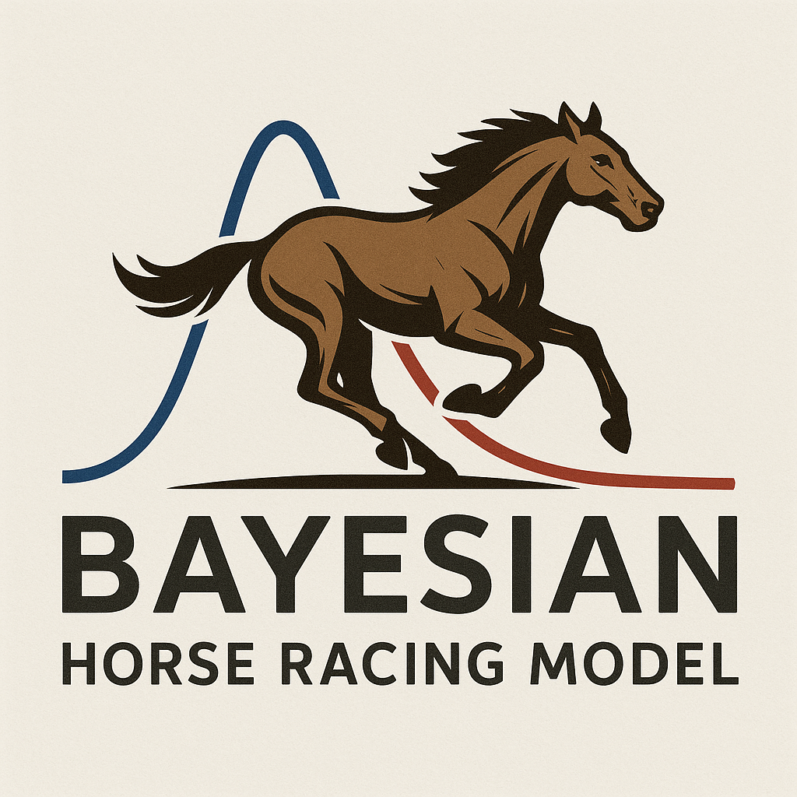

  

# British Horse Racing – Scraper & Bayesian Model

This project provides an **end-to-end pipeline** for working with British horse racing data:

- Scraping: Selenium scripts to collect fixtures, race results, horse details, and jockey details from the British Horseracing Authority (BHA).
- Data preparation: Aggregates and cleans scraped results into structured datasets.
- Modelling: A Bayesian hierarchical logistic regression (PyMC) trained on historical results to estimate win probabilities, including both fixed race features and random effects for horses, jockeys, trainers, and racecourses.
- Predictions: Generates a simple betting summary with the top pick per race.

---

## Installation

Clone the repository and create the environment:

git clone https://github.com/yourusername/british_horse_racing.git  
cd british_horse_racing  
conda env create -f environment.yml  
conda activate british_horse_racing  

You will also need a local Chrome build and a matching ChromeDriver (included here under chrome-mac-x64/ and chromedriver-mac-x64/).

---

## Usage

### 1. Scraping

Run one of the scraping scripts to collect data:

python results_scraper.py        # Monthly results  
python fixture_scraper.py        # Fixture details  
python horse_jockey_scraper.py   # Horse & jockey profiles  

The combined script full_scraper.py can run all stages in sequence.  
Scraped data is written to output/.

### 2. Training and prediction

Once results data is available, train the Bayesian model and generate predictions:

python bayesian.py  

This will write a betting summary per fixture/race to:

output/bet_summary.txt

---

## Notes

- Scraping relies on Selenium with headless Chrome; paths to Chrome and ChromeDriver are configured in the scripts.  
- The BHA site structure can change, so selectors may require updates.  
- Predictions are probabilistic estimates — use responsibly.

---
